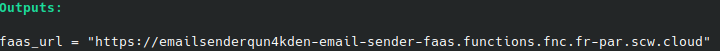
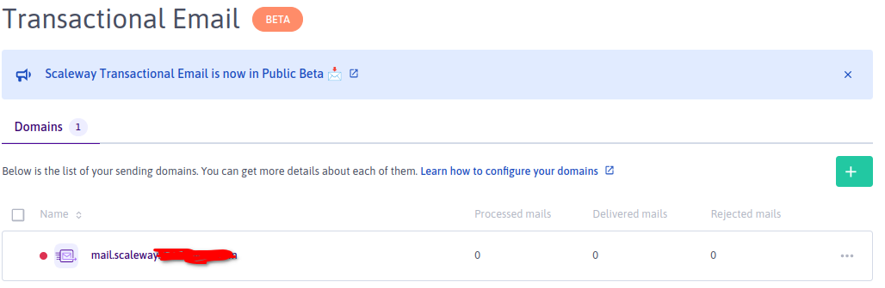
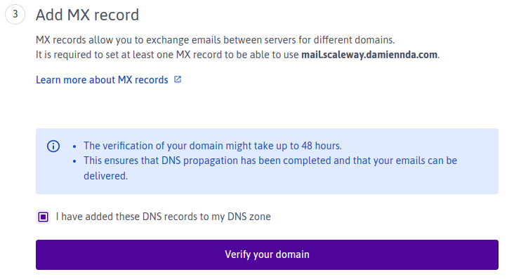

# Overview
The purpose of this project is to demonstrate the use of [Scaleway Transactional Email Service](https://www.scaleway.com/en/docs/managed-services/transactional-email/quickstart/) using the following stack :
- Terraform (Infrastructure deployment)
- NodeJS based Scaleway Faas (Serverless code to send email through smtp|TEM API)
# Deployment
## Prerequisites
- Scaleway account with an IAM Token with at least following permissions
    - Scope Organization
       - IAM Manager, Organization Manager
    - Scope Project
       - FunctionsFullAccess
       - DomainsDNSFullAccess
       - TransactionalEmailFullAccess

- Terraform >= 1.2.X
- nodejs >= 16.X.X
- Scaleway Domain Zone

NB: Another Domain Registrar can be used but it may required a slight update of our terraform regarding the SPF , DKIM Records creation

## Steps
1. Configure your environment variables, so that the scaleway terraform provider can interact with Scaleway API :
   - SCW_ACCESS_KEY
   - SCW_SECRET_KEY
   - SCW_DEFAULT_PROJECT_ID
   - SCW_DEFAULT_ORGANIZATION_ID

NB: See [here](https://registry.terraform.io/providers/scaleway/scaleway/latest/docs)

2. Copy infrastructure/terraform.tfvars.template  -> infrastructure/terraform.tfvars
    - Feed it with your Scaleway domain root zone

3. Launch **make** command at the root folder

4. After the terraform deployment is over , you must validate your TEM domain. 2 options can be used for the moment : 
- [Manual Validation](#manual-domain-validation)
- [API Oriented Validation](#api-oriented-domain-validation)

5. Retrieve your faas endpoint from terraform output


### Manual Domain Validation
Connect to your Scaleway console and triggers domain validation




### API Oriented Domain Validation
 You can call the Scaleway API, by retrieving the output "domain_validation_url", then execute the following curl on it 
 ```
 curl --location --request POST 'domain_validation_url' \
--header 'X-Auth-Token: XXXXXX-YYYYY-DDDD-CCECECECE' \
--header 'Content-Type: application/json' \
--data-raw '{}'
 ```

# Execution
The Faas can then be called using **HTTP POST** calls.
**The Faas function being private , you need first to get a token using the following [documentation](https://www.scaleway.com/en/docs/compute/functions/how-to/create-auth-token-from-console/). This token must be passed as header variable using "X-AUTH-TOKEN" field**

- Parameters
  - **mailTransport** : (type Query parameters, value (api or smtp) ) 
    - defines how the mail is send to the target
  - body : Mail content **DO NOT FORGET to fill from and to object in particular from with an email from your domain**
    ```
    {
        "from": {
            "name": "damien-test",
            "email": "XXX@mail.XXX.XXXX.com"
        },
        "to": [
            {
            "name": "Damien",
            "email": "XXX@XXXX.com"
            }
        ],
        "subject": "Transactional Email Testing API",
        "text": "Transactional Email Testing",
        "html": "<p>Some <span style=\"font-weight:bold\">Transactional Email Testing</span>.</p>"
    }
    ```


```
curl --location --request POST 'https://emailsenderqun4kden-email-sender-faas.functions.fnc.fr-par.scw.cloud?mailTransport=api' \
--header 'X-AUTH-TOKEN: ' \
--header 'Content-Type: application/json' \
--data-raw '{
        "from": {
            "name": "damien-test",
            "email": "XXX@mail.XXX.XXXX.com"
        },
        "to": [
            {
            "name": "Damien",
            "email": "XXX@XXXX.com"
            }
        ],
        "subject": "Transactional Email Testing API",
        "text": "Transactional Email Testing",
        "html": "<p>Some <span style=\"font-weight:bold\">Transactional Email Testing</span>.</p>"
    }'
```
## Cleanup
Execute make clean at the root folder.
```
make clean
```
