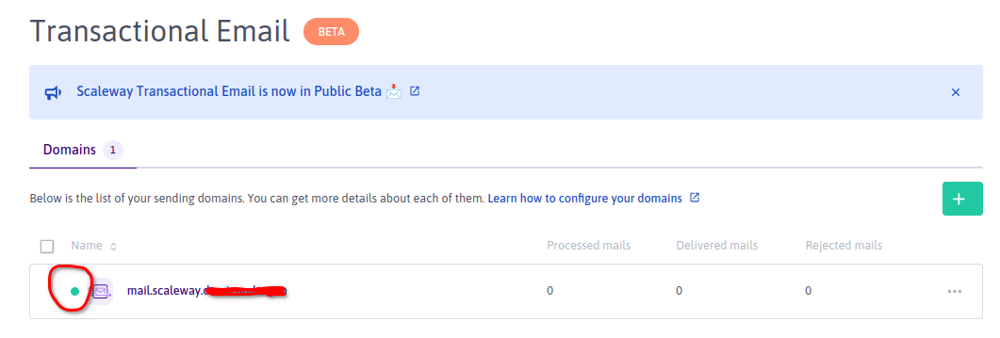

# Overview
The purpose of this project is to demonstrate the use of [Scaleway Transactional Email Service](https://www.scaleway.com/en/docs/managed-services/transactional-email/quickstart/) using the following stack :
- Terraform (Infrastructure deployment)
- NodeJS based Scaleway Faas (Serverless code to send email through smtp|TEM API)
# Deployment
## Prerequisites
- Terraform >= 1.2.X
- nodejs >= 16.X.X
- Scaleway Domain Zone
NB: Another Domain Registrar can be used but it may required a slight update of our terraform regarding the 
## Deployment
1. Copy infrastructure/terraform.tfvars.template  -> infrastructure/provider.tf
  - Feed it with your Scaleway domain root zone
2. Launch make command at the root folder
3. After the terraform deployment is over , connect to your Scaleway console and triggers domain validation

4. Retrieve your faas endpoint from terrafomrm output

NB: This step is manual for now it may be automated further